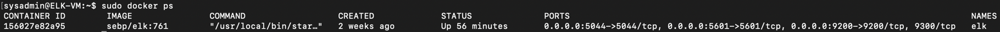

## Automated ELK Stack Deployment

The files in this repository were used to configure the network depicted below.

These files have been tested and used to generate a live ELK deployment on Azure. They can be used to either recreate the entire deployment pictured above. Alternatively, select portions of the **.yml** file may be used to install only certain pieces of it, such as Filebeat.

  - **Use the ansible-playbooks [install-elk.yml](https://github.com/PollBA9/Brandon_Pollastri_Project1/blob/main/Ansible/install-elk.yml) and the 	[filebeat-playbook.yml](https://github.com/PollBA9/Brandon_Pollastri_Project1/blob/main/Ansible/Playbook/filebeat-playbook.yml), as these are required to create and setup the Elk-Server.**

This document contains the following details:
- Description of the Topologu
- Access Policies
- ELK Configuration
  - Beats in Use
  - Machines Being Monitored
- How to Use the Ansible Build

### Description of the Topology

- The main purpose of this network is to expose a load-balanced and monitored instance of DVWA, the D*mn Vulnerable Web Application.

- Load balancing ensures that the application will be highly **efficent**, in addition to restricting **access** to the network.

- **Load Balancer adds to the availability of security in regards to the CIA Triad, and protects the servers from being overwhelmed from attacks, such as from DDoS (Distributed Denial of service).**

- **The advantage of a JumpBox is setting up a beginning point for starting Administrative Tasks. This sets the JumpBox as a "Secure Admin Workstation" or SAW for short. All Administrators conducting any Administrative Tasks will be required to connect to the JumpBox aka SAW before perfoming any task.**

Integrating an ELK server allows users to easily monitor the vulnerable VMs for changes to the **logs** and system **traffic**.
- **Filebeat watches for log files and any infomation changes that have occured; and tracks when that change took place.**
- **Metricbeat records metric & statistical data from the operating system, and from services running on the server.**

The configuration details of each machine may be found below.
_Note: Use the [Markdown Table Generator](http://www.tablesgenerator.com/markdown_tables) to add/remove values from the table_.

| Name     | Function | IP Address | Operating System |
|----------|----------|------------|------------------|
| JumpBox  | Gateway  | 10.0.0.4   | Linux            |
| Web-1    | Server   | 10.0.0.5   | Linux            |
| Web-2    | Server   | 10.0.0.6   | Linux            |
| Elk-VM   | Server   | 10.1.0.4   | Linux            |

### Access Policies

The machines on the internal network are not exposed to the public Internet. 

Only the **JumpBox** machine can accept connections from the Internet. Access to this machine is only allowed from the following IP addresses:
- **52.243.80.18**
- **In addition, Kibana can be entered via the URL from my personal IP Address**

Machines within the network can only be accessed by **SSH**.
- **For the virtual machines within the network, these can only be accessed via the JumpBox VM and it's Personal IP Address (10.0.0.4). This also includes the Elk-VM; as you'll need to connect to the JumpBox and it's Personal IP Address as well.**

A summary of the access policies in place can be found in the table below.

| Name     | Publicly Accessible | Allowed IP Addresses             |
|----------|---------------------|----------------------------------|
| Jump Box | yes                 | Personal IP Address              |
| Web-1    | No                  | 10.0.0.4                         |
| Web-2    | No                  | 10.0.0.4                         |
| Elk-VM   | No                  | 10.0.0.4, Personal IP Address    | 

### Elk Configuration

Ansible was used to automate configuration of the ELK machine. No configuration was performed manually, which is advantageous because...
- **The advantages of automating config through Ansible is it's ease of use and learning. Using of Playbooks' you are able to configure multiple VMs through the use of a single playbook, after setting up the initial configuration.**

The playbook implements the following tasks:
- **Create a New VM for Elk' give it a simple name. Make note of the Private IP (10.1.0.4) and the Public IP (0.0.0.0), you will need the Private IP to SSH into the VM and the Public IP to connect to the Kibana Portal (HTTP Site) to view all Metric logs.**
- **Download and Configure the Elk-VM docker' then you will need to add a new group [elkserver] and the Private IP (10.1.0.4) to the group. Then you need to create a new ansible-playbook (elk-config.yml) that will download, install and configure the Elk-VM, to map the ports (5601,9200,5044) and start the container.**
- **Launch and show the container after installing and starting the new container. You can verify that the container is up and working, via SSHing into the container from your JumpBox (SAW). Once you are in the Elk-VM, run the command "sudo docker ps"**
- **Create the Inbound Security Rules to allow the Ports 5601 and 9200. The Inbound Security Rules should allow access from your Personal Network."**
- **Open a new browser and type in the Public IP to access the Kibana Portal Site.**

The following screenshot displays the result of a running `docker ps` after successfully configuring the ELK instance.

### Target Machines & Beats
This ELK server is configured to monitor the following machines:
- **Web-1 (10.0.0.5), Web-2(10.0.0.6)**

We have installed the following Beats on these machines:
- **Filebeat and Metricbeat**

These Beats allow us to collect the following information from each machine:
**- Filebeat is for forwarding and setting up log data. It monitors log files as well locations that you specify, which collect into log events that forwards into either Elacticsearch or Logstash.**
**- Metricbeat takes the statistics and metrics into account, which it also collects and forwards to either Elacticsearch or Logstash.**

### Using the Playbook
In order to use the playbook, you will need to have an Ansible control node already configured. Assuming you have such a control node provisioned: 

SSH into the control node and follow the steps below:
- **Copy the [filebeat-configuration.yml](https://github.com/PollBA9/Brandon_Pollastri_Project1/blob/main/Ansible/Configuration/filebeat-configuration.yml) and [metricbeat-configuration.yml](https://github.com/PollBA9/Brandon_Pollastri_Project1/blob/main/Ansible/Configuration/metricbeat-configuration.yml) files to /etc/ansible/host.**
- **Update the configuration files to include the Private IP of the Elk-VM to the ElasticSearch and Kibana area of the configuration file.**
- **Run the playbook, and navigate to Elk-VM to check that the installation worked as expected. [docker ps]**

_TODO: Answer the following questions to fill in the blanks:_
- **The playbook is called filebeat-playbook.yml. You copy the file to the "/etc/Ansible/Playbook/" directory.**
- **The file you need to update is the [filebeat-configuration.yml](https://github.com/PollBA9/Brandon_Pollastri_Project1/blob/main/Ansible/Configuration/filebeat-configuration.yml) file which is a configuration file which will be dropped into the Elk-VM during the run of the ansible playbook. When you update the host.cfg file in the ansible directory you will need to create a new group and add the Private IP of the Elk-VM to the group. Then when configuring the [filebeat-configuration.yml](https://github.com/PollBA9/Brandon_Pollastri_Project1/blob/main/Ansible/Configuration/filebeat-configuration.yml) file you need to designate the Private IP of the Elk-VM.**
- **The URL used to verify that the Elk-VM is running' is the Public IP (0.0.0.0:5601).**

Bonus: The commands needed to run the Ansible configuration for the Elk-VM:

- ssh sysadmin@JumpBox(PrivateIP)
- sudo docker container list -a (locates your ansible container)
- sudo docker start container (name of the container)
- sudo docker attach container (name of the container)
- cd /etc/ansible/
- ansible-playbook elk-config.yml (configures Elk-VM and starts the Elk container on the Elk-VM) wait a couple minutes for the implementation of the Elk-VM.
- cd /etc/ansible/roles/
- cd ansible, playbook filebeat-playbook.yml (installs Filebeat and Metricbeat)
- open a web browser (52.243.80.18:5601/app/kibana#/home or Elk-VM PublicIP:5601) This will show the Kibana Web Portal.
